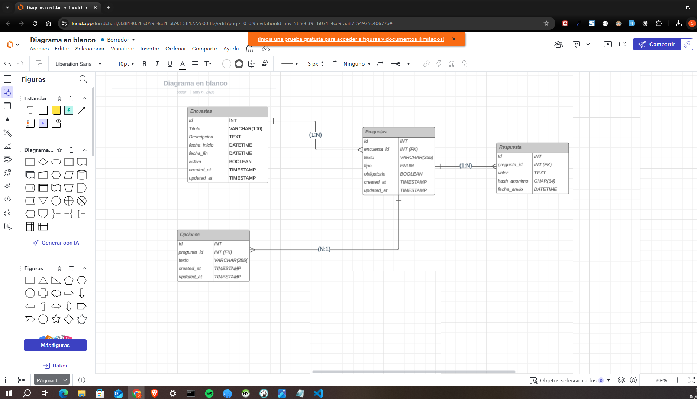

1. Pregunta 1
Respuesta : 

2. Pregunta 2 
. Pasos para la instalacion : 

# 1 Requisitos :
- PHP 8.1+
- Composer 2.2+
- Node.js 16+
- MySQL 5.7+
- Git
# 2 Instalacion :
- composer install
- npm install
- npm install bootstrap @popperjs/core

# 3 Conexion a la BD:
DB_CONNECTION=mysql
DB_HOST=127.0.0.1
DB_PORT=3306
DB_DATABASE=test
DB_USERNAME=root
DB_PASSWORD=

# 4 Ejecutar las migraciones
- php artisan migrate

# 5 Compilar assets:
- npm run dev

# 6 Iniciar el servidor de desarrollo
- php artisan serve

# 7 Acceder a la aplicacion
- http://localhost:8000/vehicles

